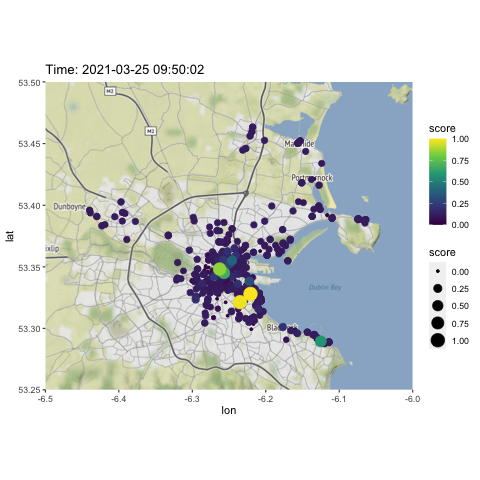

# BrokenBikes
Bleeper Bikes has revolutionised active travel in Dublin. With over 600 GPS tracked bikes across the city region, users can easily access high quality bikes on a per use basis. The ability to make trips without the overhead of buying a bike and the risk of theft has lead thousands of Dubliners to reorient towards cycling. Additionally, the dockless nature of Bleeper’s system allows users to traverse areas of the city out of the range of Dublin Bikes system that focuses on serving users inside the canals. 

The success of Bleeper’s system is evident in user testimonials available on the App Store and Google Play Store. An analysis of public reviews on both stores, represented in the word cloud below highlights the flexibility, convenience and freedom afforded by the Bleeper system. 

The analysis also reveals issues in the bike-sharing system. Many reviews describe the app directing them to broken, faulty bikes. Issues with bike quality was the primary reason for poor reviews given by users in both stores. Improving bike reliability would greatly enhance the Bleeper’s UX, further encouraging Dubliner’s to substitute more journeys into cycling. 

The nature of the Bleeper system, where bikes are constantly traversing large regions of the city, make regular maintenance of all bikes costly and inefficient. As well as diminishing the user experience, maintenance overheads force Bleeper to restrict the number and variety of bikes in their system as well as the geographic scope of their service. 

This proposal, to detect bikes requiring maintenance in real-time has the potential to radically enhance bike-sharing systems in the city. If implemented, this proposal would have benefits for both users and operators. A reliable and fast program for detecting bicycles that require maintenance could be naturally incorporated into user-facing apps. Bicycles that are predicted to require maintenance can be flagged to the user in advance of rental. Users could track the nearest bicycle that is guaranteed to be operable. Service crews that are currently required to scour the city in search of bicycles that require maintenance, or operate on regular maintenance schedules, can optimise their working time. They can be directed to bicycles that are predicted to require maintenance. This both increases the value of their work and reduces the time bicycles are inoperable. 

Over the medium term, bicycle-sharing companies will have increased confidence in their maintenance operations. This should facilitate the expansion of the current network of bicycles deeper into Dublin’s suburban regions and the rollout of e-bicycles, which by nature are more complex and expensive to operate. The program could be extended to detect low-battery e-bicycles. The knock-on benefits for users are multiple: improved access to better bicycles, increased cycling safety and more reliable service. Such improvements will only encourage existing users to cycle more and extend the draw of bicycle-sharing services to people of all ages, in all areas of our city. 

This repository contains code for the implementation of the broken bikes detection method developed as part of the (ongoing) SmartDublin Active Travel Competition 2021. The method aims to attach a score, related to the probability the bike is unusable, for each bike in the Bleeper Bikes bike-sharing network in Dublin, Ireland. As the competition continues, this repository will be updated as work progresses with data, code and analysis of the method's strengths and weaknesses. 

Items currently in the repository:
- **bike_scrape.R** This script scrapes the Bleeper Bikes JSON file which updates at 5-minutes intervals and saves to .csv files. 
- **weather_scrape.R** This script scrapes weather information from Weather Underground and updates at 2-hour intervals. Scraped data is saved to a .csv. Note: The API key used to scrape from WeatherUnderground has been removed from the script and must be replaced for the code to work. 
- **grids.csv**  Our method divides the Dublin region into 100 grids, for which contextual environmental information such as elevation, light pollution etc. is captured. This file contains information for the associated grids. 
- **PrepData.R** This script reads in the Bike.csv, weather.csv and grids.csv files, cleans and augments them with features constructed to aid the detection of broken bikes. For each bike, the distance to the next nearest bike, the length of the previous trip and the time since the last trip are included. 
- **RF.R** This script implements V1 of the broken bike detection method. Using a 24hr period of bike data, a Random Forest regression model is trained to predict the time since the last trip based on environmental, weather and bike-specific features. This model is stored and used to produce a 'predicted stationary time' score for each bike, based on its last trip and location in the city. Bikes that have been stationary for significantly longer than was predicted by the model are flagged as potentially broken. A sample image of the scores is given below. 
- **Animate.R** This script can be used to create gifs of bikes moving around the city using the live-updating JSON files. 

 
